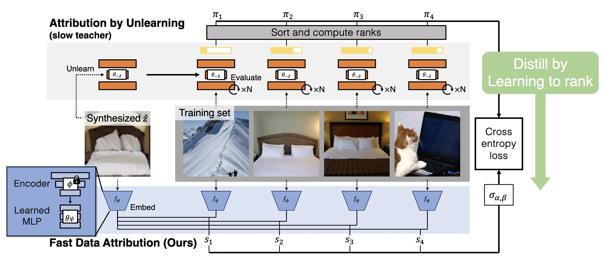

## Fast Data Attribution for Text-to-Image Models
[**Project**](https://peterwang512.github.io/FastGDA/) | [**Paper**](https://www.arxiv.org/abs/2511.10721)

[Sheng-Yu Wang](https://peterwang512.github.io/)<sup>1</sup>, [Aaron Hertzmann](https://www.dgp.toronto.edu/~hertzman/)<sup>2</sup>, [Alexei A. Efros](https://people.eecs.berkeley.edu/~efros/)<sup>3</sup>, [Richard Zhang](http://richzhang.github.io/)<sup>2</sup>, [Jun-Yan Zhu](https://cs.cmu.edu/~junyanz)<sup>1</sup>.
<br> Carnegie Mellon University<sup>1</sup>, Adobe Research<sup>2</sup>, UC Berkeley<sup>3</sup>
<br>In NeurIPS, 2025.

<p align="center">

</p>


---

### Abstract

Data attribution for text-to-image models aims to identify the training images that most significantly influenced a generated output. Existing attribution methods involve considerable computational resources for each query, making them impractical for real-world applications. We propose a novel approach for scalable and efficient data attribution. Our key idea is to distill a slow, unlearning-based attribution method to a feature embedding space for efficient retrieval of highly influential training images. During deployment, combined with efficient indexing and search methods, our method successfully finds highly influential images without running expensive attribution algorithms. We show extensive results on both medium-scale models trained on MSCOCO and large-scale Stable Diffusion models trained on LAION, demonstrating that our method can achieve better or competitive performance in a few seconds, faster than existing methods by 2,500x - 400,000x. Our work represents a meaningful step towards the large-scale application of data attribution methods on real-world models such as Stable Diffusion.

## Quick Start

### Environment Setup

Create a conda/micromamba environment with all dependencies:

```bash
# Using conda
conda env create -f environment.yaml
conda activate fastgda

# Or using micromamba (faster)
micromamba env create -f environment.yaml
micromamba activate fastgda
```
(We mainly test our environment on micromamba.)


### Download Data and Weights

All data files (pretrain weights, precomputed features, COCO images, influence rankings, and query images) are available on [HuggingFace](https://huggingface.co/datasets/sywang/FastGDA):

Download everything with a single command:

```bash
# Use the download script (~15GB total)
bash scripts/download_data.sh
```

(If you experienced rate limit by huggingface download, please rerun this script multiple times.)

The download script will automatically:
1. Download precomputed features for all feature types (DINO, CLIP, CLIP text, DINO+CLIP text)
2. Download and extract COCO train2017 images (concatenates split tar files)
3. Download ground truth influence rankings (influence_train.pkl, influence_test.pkl)
4. Download query images with precomputed latents and text embeddings
5. Download pretrain weight files

Expected data structure after download:

```
data/coco/
├── train2017/                     # COCO training images
├── feats/                         # Precomputed features
│   ├── dino+clip_text/
│   │   ├── data_feats.npy         # [118287, 1280] training features
│   │   ├── train_query_feats.npy  # [5000, 1280] training queries
│   │   └── test_query_feats.npy   # [1000, 1280] test queries
│   ├── dino/
│   ├── clip/
│   └── clip_text/
├── influence_train.pkl            # Ground truth training influences
├── influence_test.pkl             # Ground truth test influences
├── query_train/                   # Training query images
│   ├── images/
│   ├── latents.npy
│   ├── text_embeddings.npy
│   └── nn_dino.pkl
└── query_test/                    # Test query images
    ├── images/
    ├── latents.npy
    └── text_embeddings.npy
```

### Run Interactive Demo

Launch a Gradio demo to explore image attributions:

```bash
python demo.py \
    --checkpoint weights/dino+clip_text.pth \
    --data_dir data/coco \
    --feature_dir data/coco/feats/dino+clip_text
```

The demo will:
1. Load a generated image and its caption
2. Compute calibrated features using the trained model
3. Rank all training images by influence score
4. Display the top-k most influential training images

## Training the Ranker

### Prerequisites

Before training, you need to run the data download script `scripts/download_data.sh`.


### Train on COCO Dataset

Train a model using DINO + CLIP text features from this script:

```bash

bash scripts/train_coco.sh
```

### Training Arguments

**Dataset Settings:**
- `--ftype`: Feature type (e.g., `dino+clip_text`, `dino`, `clip`)
- `--data_dir`: Directory containing feature files
- `--rank_file`: Path to ground truth influence rankings (.pkl)

**Model Architecture:**
- `--hidden_sizes`: Hidden layer sizes (default: `[768, 768, 768]`)
- `--input_norm`: Use layer normalization on input
- `--dropout`: Dropout probability (default: `0.1`)
- `--out_feat_dim`: Output feature dimension (default: `768`)

**Training Hyperparameters:**
- `--epochs`: Number of epochs (default: `10`)
- `--batch_size`: Batch size (default: `4096`)
- `--lr`: Learning rate (default: `0.001`)

**Logging:**
- `--wandb`: Enable Weights & Biases logging
- `--wandb_project`: W&B project name (default: `fastgda`)

### Evaluation

Evaluate a trained model on the test set:

```bash
bash scripts/eval_coco.sh
```

This computes **mAP@k** (mean average precision at k) for different values of k, measuring how well the model ranks truly influential training images.

## (Optional) Preprocessing Pipeline

If you want to generate features and influence rankings from scratch, follow these steps:

### Step 1: Download Raw Data

In case you haven't download the data, run `bash scripts/download_data.sh`.

### Step 2: Extract Features

Extract DINO, CLIP, and text features from images:

```bash
cd feature_extraction

# Extract all features (takes ~60-90 minutes on A100)
bash extract_coco.sh

# This will generate:
# - dino features (768-dim)
# - clip features (512-dim)
# - clip_text features (512-dim)
# - dino+clip_text features (1280-dim)
cd ..
```

The features will be stored in `data/coco/feats_test` by default. You can change the output location by specifying `FEAT_DIR` argument in `feature_extraction/extract_coco.sh`.

### Step 3: Compute Ground Truth Influences

Compute expensive ground truth influence scores using AttributeByUnlearning(AbU). See `abu/coco/README.md` for detailed documentation.

## Acknowledgments

We thank Simon Niklaus for the help on the LAION image retrieval. We thank Ruihan Gao, Maxwell Jones, and Gaurav Parmar for helpful discussions and feedback on drafts. Sheng-Yu Wang is supported by the Google PhD Fellowship. The project was partly supported by Adobe Inc., the Packard Fellowship, the IITP grant funded by the Korean Government (MSIT) (No. RS-2024-00457882, National AI Research Lab Project), NSF IIS-2239076, and NSF ISS-2403303.

## Citation

If you use FastGDA in your research, please cite:

```bibtex
@inproceedings{wang2025fastgda,
  title={Fast Data Attribution for Text-to-Image Models},
  author={Wang, Sheng-Yu and Hertzmann, Aaron and Efros, Alexei A and Zhang, Richard and Zhu, Jun-Yan},
  booktitle={NeurIPS},
  year = {2025},
}
```
